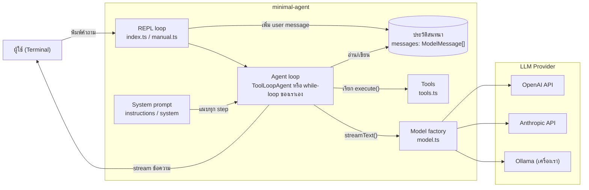
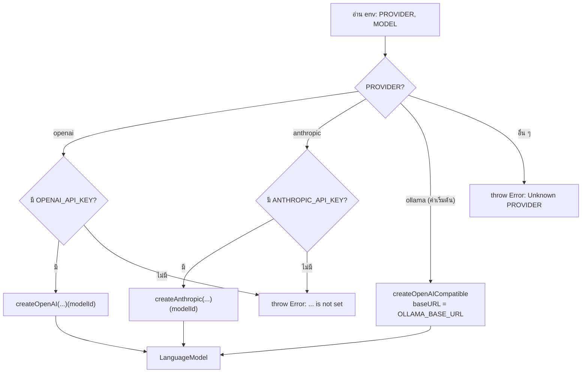
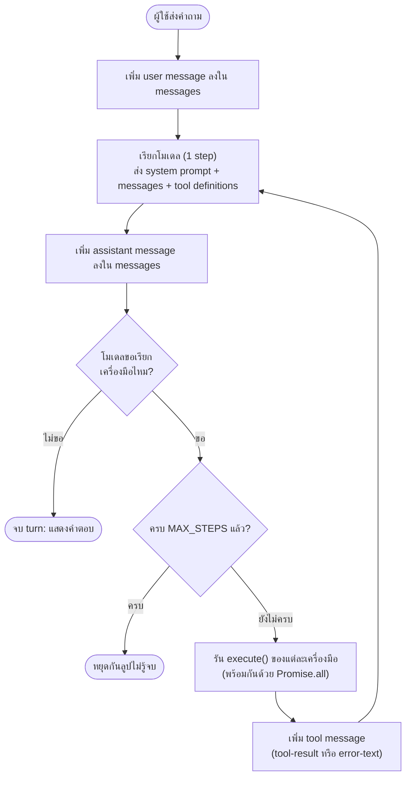
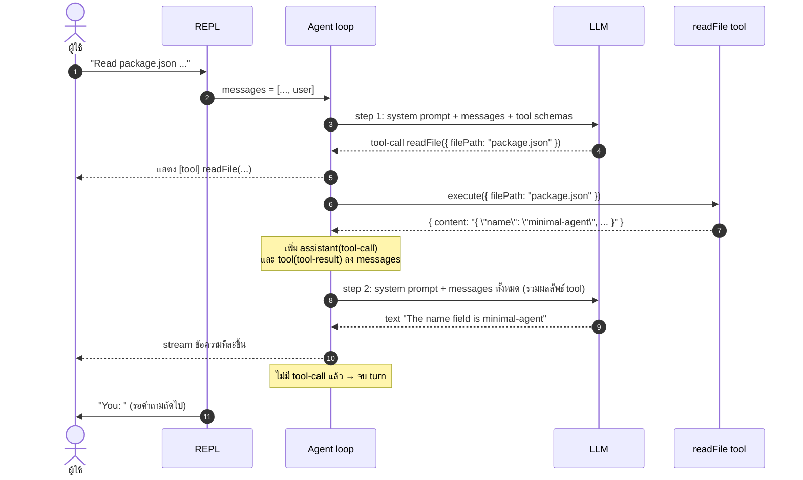
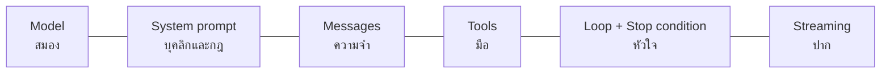
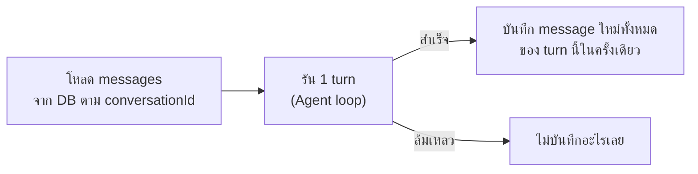

# Agent นี้ทำงานอย่างไร (เบื้องหลัง)

เอกสารนี้อธิบายว่า `minimal-agent` ทำงานอย่างไรตั้งแต่ผู้ใช้พิมพ์ข้อความจนได้คำตอบ
และแยกให้เห็นว่า **องค์ประกอบสำคัญ** ที่ต้องมีเพื่อสร้าง AI Agent มีอะไรบ้าง

> **Agent คืออะไร?**
> LLM เพียงอย่างเดียวทำได้แค่ "รับข้อความ → ตอบข้อความ"
> Agent คือ LLM ที่ถูกวางไว้ใน **ลูป** และมี **เครื่องมือ (tools)** ให้เรียกใช้
> โมเดลเป็นผู้ตัดสินใจว่าจะเรียกเครื่องมือไหน โค้ดของเราเป็นผู้รันเครื่องมือนั้นจริง ๆ
> แล้วส่งผลลัพธ์กลับไปให้โมเดลคิดต่อ จนกว่าโมเดลจะตอบได้

---

## ภาพรวมสถาปัตยกรรม



| ไฟล์ | หน้าที่ |
| --- | --- |
| [`src/model.ts`](../src/model.ts) | เลือกและสร้างโมเดลจาก environment variables |
| [`src/tools.ts`](../src/tools.ts) | นิยามเครื่องมือที่ Agent ใช้ได้ |
| [`src/index.ts`](../src/index.ts) | REPL + Agent loop แบบสำเร็จรูป (`ToolLoopAgent`) |
| [`src/manual.ts`](../src/manual.ts) | REPL + Agent loop ที่เขียนเอง (`while`-loop) |

---

## องค์ประกอบสำคัญ 6 อย่างของ Agent

### 1. Model: "สมอง" ของ Agent

ไฟล์ [`src/model.ts`](../src/model.ts) คืนค่า `LanguageModel` ซึ่งเป็น interface กลางของ AI SDK
ทำให้โค้ดส่วนอื่นไม่ต้องรู้เลยว่าข้างหลังคือ OpenAI, Anthropic หรือ Ollama



จุดที่น่าสนใจ:

- **Ollama ใช้ `@ai-sdk/openai-compatible`**: Ollama เปิด endpoint ที่หน้าตาเหมือน OpenAI ไว้ที่
  `http://localhost:11434/v1` เราจึงไม่ต้องใช้ provider เฉพาะของ Ollama
  และเปลี่ยน `OLLAMA_BASE_URL` ไปชี้ LM Studio, llama.cpp หรือ vLLM ได้ทันที
- **ตรวจ API key ตั้งแต่เริ่มโปรแกรม** (`requireEnv`) ถ้าไม่มี key จะหยุดพร้อมข้อความที่บอกว่าต้องตั้งค่าอะไร
  แทนที่จะไปพังตอนเรียก API ครั้งแรก
- โมเดลที่ใช้กับ Agent **ต้องรองรับ tool calling** (เช่น `qwen3.5:9b`) ไม่อย่างนั้นโมเดลจะเรียกเครื่องมือไม่ได้

### 2. System prompt: "บุคลิกและกฎ" ของ Agent

System prompt คือคำสั่งจากนักพัฒนาที่บอกโมเดลว่า Agent ตัวนี้ **เป็นใคร ทำอะไร และต้องทำตัวอย่างไร**
ถ้าไม่มี Agent ยังทำงานได้ เพราะโมเดลเห็นชื่อ คำอธิบาย และ schema ของ tools อยู่แล้ว
แต่จะไม่มีอะไรกำหนดพฤติกรรม โมเดลจะทำตามค่าเริ่มต้นของตัวเอง ซึ่งแต่ละโมเดลไม่เหมือนกัน

สิ่งที่ควรเขียนใน system prompt ของ Agent:

| หัวข้อ | ตัวอย่าง |
| --- | --- |
| บทบาทและขอบเขต | "คุณเป็นผู้ช่วยตอบคำถามเกี่ยวกับโค้ดในโปรเจกต์นี้ ไม่ตอบเรื่องอื่น" |
| นโยบายการใช้ tools | "ถ้าคำถามเกี่ยวกับเนื้อหาไฟล์ ให้อ่านด้วย `readFile` ก่อนตอบ ห้ามเดา" |
| การรับมือเมื่อ tool ล้มเหลว | "ถ้า tool คืน error ให้บอกผู้ใช้ตรง ๆ ว่าทำไม่ได้เพราะอะไร อย่าเรียกซ้ำเกิน 1 ครั้ง" |
| การจบ turn | "หลังได้ผลจาก tool ให้สรุปคำตอบให้ผู้ใช้เสมอ" |
| รูปแบบคำตอบ | ภาษา ความยาว format (markdown, bullet ฯลฯ) |

ในโปรเจกต์นี้ system prompt มีแค่ประโยคเดียว ซึ่งพอสำหรับตัวอย่างขั้นต่ำ:

```ts
'You are a helpful assistant. Use the available tools when they help answer.'
```

> **ตัวอย่างจากการทดสอบจริง:** `qwen3.5:9b` บางครั้งเรียก tool แล้วจบ turn โดยไม่ตอบอะไรเลย
> กฎ "หลังได้ผลจาก tool ให้สรุปคำตอบให้ผู้ใช้เสมอ" เป็นวิธีแก้แรกที่ควรลอง
> (ยังไม่ได้ทดสอบว่าช่วยได้แค่ไหน)

**System prompt ไม่ได้อยู่ใน `messages`:** เราส่งแยกผ่าน option ของ SDK

- `index.ts`: `new ToolLoopAgent({ instructions: ... })`
- `manual.ts`: `streamText({ system: SYSTEM, ... })`

SDK จะแนบ system prompt ไปให้โมเดล **ทุก step** เอง ข้อดีคือ system prompt
ไม่ปนกับประวัติสนทนา และไม่หายไปตอนย้อน `messages` กลับเมื่อ turn ล้มเหลว

### 3. Messages: "ความจำ" ของ Agent

LLM ไม่มีความจำในตัว ทุกครั้งที่เรียกโมเดล เราต้องส่ง **ประวัติสนทนาทั้งหมด** ไปด้วย
ประวัตินี้เก็บอยู่ใน array `messages: ModelMessage[]`
role ที่อยู่ใน array นี้ในโปรเจกต์ของเรามี 3 แบบ (role `system` ก็มีอยู่ใน `ModelMessage`
แต่เราส่ง system prompt แยกตามหัวข้อ 2 แทน):

| role | ใครเขียน | ตัวอย่างเนื้อหา |
| --- | --- | --- |
| `user` | ผู้ใช้ | `"ตอนนี้กี่โมง?"` |
| `assistant` | โมเดล | ข้อความตอบ, reasoning, **คำขอเรียกเครื่องมือ (`tool-call`)** |
| `tool` | โค้ดของเรา | **ผลลัพธ์จากเครื่องมือ (`tool-result`)** |

ตัวอย่าง `messages` หลังจบ 1 รอบคำถาม "ตอนนี้กี่โมง?":

```ts
[
  { role: 'user', content: 'ตอนนี้กี่โมง?' },
  {
    role: 'assistant',
    content: [
      { type: 'tool-call', toolCallId: 'call_1', toolName: 'getCurrentTime', input: {} },
    ],
  },
  {
    role: 'tool',
    content: [
      {
        type: 'tool-result',
        toolCallId: 'call_1', // ต้องตรงกับ tool-call ด้านบน
        toolName: 'getCurrentTime',
        output: { type: 'json', value: { now: '2026-10-04T01:30:17.823Z' } },
      },
    ],
  },
  { role: 'assistant', content: [{ type: 'text', text: 'ตอนนี้เวลา 01:30 UTC ครับ' }] },
]
```

> `toolCallId` คือตัวผูก "คำขอ" กับ "ผลลัพธ์" เข้าด้วยกัน
> ถ้าโมเดลเรียกหลายเครื่องมือพร้อมกัน โมเดลจะรู้ว่าผลลัพธ์ไหนเป็นของคำขอไหนจาก id นี้

### 4. Tools: "มือ" ของ Agent

ไฟล์ [`src/tools.ts`](../src/tools.ts) นิยามเครื่องมือด้วยฟังก์ชัน `tool()` ซึ่งมี 3 ส่วน:

```ts
readFile: tool({
  description: 'Read a UTF-8 text file from the current working directory.', // ① บอกโมเดลว่าใช้ทำอะไร
  inputSchema: z.object({ filePath: z.string().describe('...') }),          // ② รูปแบบ input
  execute: async ({ filePath }) => { /* ... */ },                           // ③ โค้ดที่รันจริง
}),
```

| ส่วน | ใครใช้ | หน้าที่ |
| --- | --- | --- |
| `description` | **โมเดล** | ใช้ตัดสินใจว่า "ควรเรียกเครื่องมือนี้ไหม" ยิ่งเขียนชัด โมเดลยิ่งเลือกถูก |
| `inputSchema` | **โมเดล + SDK** | SDK แปลง Zod schema เป็น JSON Schema ส่งให้โมเดล และใช้ตรวจ input ที่โมเดลส่งกลับมา |
| `execute` | **โค้ดของเรา** | ทำงานจริงบนเครื่องเรา โมเดลไม่เคยเห็นโค้ดส่วนนี้ เห็นแค่ผลลัพธ์ |

สิ่งที่ต้องเข้าใจ: **โมเดลไม่ได้รันเครื่องมือเอง** โมเดลแค่ตอบกลับมาว่า
"ฉันอยากเรียก `readFile` ด้วย `{ filePath: 'package.json' }`" แล้วโปรแกรมของเราเป็นผู้รัน
ดังนั้นความปลอดภัยต้องอยู่ใน `execute` เช่น `readFile` ปฏิเสธการอ่านไฟล์นอกโฟลเดอร์โปรเจกต์
(ทดสอบแล้ว: ขอ `../../.zshrc` จะได้ error กลับไป)

### 5. Agent Loop: "หัวใจ" ของ Agent

นี่คือสิ่งที่เปลี่ยน LLM ธรรมดาให้เป็น Agent การเรียกโมเดล 1 ครั้งเรียกว่า **1 step**
ใน 1 รอบคำถามของผู้ใช้ (1 turn) อาจมีหลาย step:



**เงื่อนไขหยุด (stop condition) สำคัญมาก:** ถ้าไม่มี โมเดลที่สับสนอาจเรียกเครื่องมือวนไปเรื่อย ๆ
และเปลืองเงินหรือเวลา โปรเจกต์นี้จำกัดไว้ที่ 10 step ต่อ turn

### 6. Streaming: "ปาก" ของ Agent

แทนที่จะรอให้โมเดลตอบเสร็จทั้งหมด เราใช้ `streamText` / `agent.stream` ซึ่งคืน stream ของ **parts**
ทำให้ผู้ใช้เห็นข้อความทยอยขึ้นมาทันที:

| part type | ความหมาย | สิ่งที่เราทำ |
| --- | --- | --- |
| `text-delta` | ข้อความชิ้นเล็ก ๆ จากโมเดล | พิมพ์ออกหน้าจอทันที |
| `tool-call` | โมเดลขอเรียกเครื่องมือ | พิมพ์ `[tool] name(args)` |
| `reasoning-delta` | ความคิดของโมเดล (โมเดลแบบ thinking) | ไม่แสดง |
| `error` | เกิดข้อผิดพลาดระหว่าง stream | `throw` ออกไปให้ REPL จัดการ |
| `start-step` / `finish-step` | ขอบเขตของแต่ละ step | ไม่ได้ใช้ |

---

## ลำดับเหตุการณ์จริงของ 1 turn

ตัวอย่างคำถาม "Read package.json and tell me the name field" (ทดสอบกับ `qwen3.5:9b` จริง):



สังเกตว่าโมเดลถูกเรียก **2 ครั้ง** สำหรับคำถามเดียว ครั้งแรกเพื่อตัดสินใจเรียกเครื่องมือ
ครั้งที่สองเพื่อเรียบเรียงคำตอบจากผลลัพธ์

---

## สองวิธีสร้าง Agent loop ในโปรเจกต์นี้

### แบบที่ 1: `ToolLoopAgent` ([`src/index.ts`](../src/index.ts))

```ts
const agent = new ToolLoopAgent({
  model,
  instructions: 'You are a helpful assistant. ...',
  tools,                       // tools ที่มี execute → SDK รันให้เอง
  stopWhen: isStepCount(10),   // เงื่อนไขหยุด
});

const result = await agent.stream({ messages });
// ...
messages.push(...(await result.responseMessages)); // ได้ทุก message ของทุก step มาในครั้งเดียว
```

SDK ทำลูปทั้งหมดในแผนภาพด้านบนให้ เราแค่ส่ง `messages` เข้าไปแล้วรับ `responseMessages` กลับมา

### แบบที่ 2: เขียน while-loop เอง ([`src/manual.ts`](../src/manual.ts))

กุญแจสำคัญคือ **ตัด `execute` ออกจาก tool ก่อนส่งให้โมเดล**
SDK จะรันเครื่องมือเองไม่ได้ จึงหยุดทุกครั้งที่โมเดลขอเรียกเครื่องมือ แล้วคืนการควบคุมให้เรา:

```ts
const toolDefinitions = Object.fromEntries(
  Object.entries(tools).map(([name, { execute, ...definition }]) => [name, definition]),
);

for (let step = 1; step <= MAX_STEPS; step++) {
  const result = streamText({ model, system: SYSTEM, messages, tools: toolDefinitions });
  // ... stream ข้อความออกจอ ...

  messages.push(...(await result.responseMessages)); // assistant message ของ step นี้

  const toolCalls = await result.toolCalls;
  if (toolCalls.length === 0) return;                 // ไม่ขอเรียกเครื่องมือแล้ว → จบ

  const results = await Promise.all(toolCalls.map(/* runTool → tool-result */));
  messages.push({ role: 'tool', content: results });  // ส่งผลลัพธ์กลับให้โมเดลใน step ถัดไป
}
```

`runTool` จับ error ทุกกรณี (เครื่องมือ throw หรือโมเดลเรียกเครื่องมือที่ไม่มีอยู่)
แล้วส่งกลับเป็น `{ type: 'error-text', value: '...' }` แทนการทำให้โปรแกรมพัง
โมเดลจะเห็น error นั้นและปรับตัวได้ เช่น บอกผู้ใช้ว่าอ่านไฟล์ไม่ได้

### เปรียบเทียบ

| | `ToolLoopAgent` | while-loop เอง |
| --- | --- | --- |
| ปริมาณโค้ด | น้อย | มากกว่า |
| ใครรันเครื่องมือ | SDK | โค้ดของเรา (`runTool`) |
| เงื่อนไขหยุด | `stopWhen: isStepCount(10)` | `for (step <= MAX_STEPS)` + `toolCalls.length === 0` |
| ควบคุมระหว่าง step | ผ่าน callback/option ที่ SDK มีให้ | ทำอะไรก็ได้ เช่น ขออนุมัติจากผู้ใช้ก่อนรันเครื่องมือ, log, retry |
| เหมาะกับ | ใช้งานทั่วไป | เรียนรู้กลไก หรือต้องการควบคุมละเอียด |

ทั้งสองแบบให้ผลเหมือนกัน เพราะ `ToolLoopAgent` ทำงานภายในแบบเดียวกับ `manual.ts`

---

## การจัดการ error ระดับ turn

ถ้า turn ล้มเหลว (เช่น เครือข่ายหลุด หรือ Ollama ไม่ได้เปิด) REPL จะ **ย้อน `messages` กลับ**
ไปเป็นสถานะก่อนเริ่ม turn เพื่อไม่ให้ประวัติสนทนาค้างครึ่ง ๆ กลาง ๆ
(เช่น มี `tool-call` ที่ไม่มี `tool-result` คู่กัน ซึ่ง provider ส่วนใหญ่จะปฏิเสธ)

- `index.ts`: `messages.pop()` เอา user message ออก (SDK ยังไม่ได้เพิ่มอะไรลง `messages`)
- `manual.ts`: `messages.length = turnStart` ตัดทุก message ที่เพิ่มใน turn นั้นทิ้ง
  เพราะลูปของเราเพิ่ม message ลงไปทีละ step

---

## สรุป: สูตรสร้าง Agent



1. **Model**: LLM ที่รองรับ tool calling
2. **System prompt**: บทบาท ขอบเขต และกฎการใช้เครื่องมือ แนบไปทุก step
3. **Messages**: ประวัติสนทนาที่ส่งไปทุกครั้ง รวมทั้ง tool-call และ tool-result
4. **Tools**: `description` + `inputSchema` ให้โมเดลรู้จัก, `execute` ให้โค้ดเรารัน
5. **Loop**: เรียกโมเดล → รันเครื่องมือ → ส่งผลกลับ → วนจนโมเดลตอบเสร็จ พร้อมเงื่อนไขหยุด
6. **Streaming**: แสดงผลทันทีให้ผู้ใช้เห็นว่า Agent กำลังทำอะไร

อยากเพิ่มความสามารถให้ Agent? ส่วนใหญ่แค่เพิ่มเครื่องมือใหม่ใน [`src/tools.ts`](../src/tools.ts)
ทั้งสองไฟล์ (`index.ts` และ `manual.ts`) จะเห็นเครื่องมือใหม่ทันที

---

## คำถามที่พบบ่อย (FAQ)

### 1. ทำไมต้องใช้ Zod?

ใน `tool()` ตัว `inputSchema` ทำงาน 3 อย่างพร้อมกัน และ Zod ทำให้เขียน schema ครั้งเดียวแล้วได้ครบทั้ง 3 อย่าง:

```ts
inputSchema: z.object({
  filePath: z.string().describe('Path relative to the current working directory'),
}),
```

| หน้าที่ | เกิดอะไรขึ้น |
| --- | --- |
| **บอกโมเดล** | SDK แปลง Zod schema เป็น **JSON Schema** แล้วส่งให้โมเดลในทุก step ส่วน `.describe()` จะกลายเป็น `description` ของ field ช่วยให้โมเดลรู้ว่าต้องใส่ค่าอะไร |
| **ตรวจ input จากโมเดล** | โมเดลอาจส่ง input ผิดรูปแบบ (ขาด field, ผิด type) SDK ใช้ schema เดียวกันตรวจ **ก่อน** ส่งเข้า `execute` input ที่ผิดจะไม่ถึงโค้ดของเรา |
| **ให้ type กับ TypeScript** | `execute: async ({ filePath }) => ...` ได้ type `filePath: string` อัตโนมัติ ไม่ต้องเขียน type ซ้ำ |

**ไม่ใช้ Zod ได้ไหม?** ได้ `inputSchema` ใน AI SDK v7 รับ schema ได้หลายแบบ:

- schema จาก library อื่นที่รองรับ [Standard Schema](https://standardschema.dev) เช่น Valibot, ArkType
- `jsonSchema({...})` จาก `ai` เขียน JSON Schema ตรง ๆ ได้ แต่ต้องเขียน TypeScript type เอง
  และไม่มีการตรวจ input จริงจนกว่าจะส่งฟังก์ชัน `validate` ให้เอง

โปรเจกต์นี้เลือก Zod เพราะตัวอย่างในเอกสาร AI SDK ใช้ Zod เป็นหลัก

### 2. Messages สามารถนำไปเก็บใน database ได้หรือไม่?

**ได้** และควรทำถ้าต้องการให้บทสนทนาอยู่ต่อหลังปิดโปรแกรม (ตอนนี้ `messages` อยู่แค่ใน memory ปิดโปรแกรมแล้วหาย)
`ModelMessage` เป็น object ธรรมดา ในโปรเจกต์นี้มีแต่ข้อความและ JSON จึง `JSON.stringify` เก็บได้ตรง ๆ



ข้อควรระวัง:

- **บันทึกทั้ง turn ในครั้งเดียว (transaction):** เหตุผลเดียวกับการย้อน `messages` เมื่อ error
  ถ้าบันทึก `tool-call` แต่ไม่ได้บันทึก `tool-result` คู่กัน ประวัตินั้นจะเสีย
  และ provider ส่วนใหญ่จะปฏิเสธเมื่อส่งไปครั้งหน้า
- **รูปแบบการเก็บ:** เก็บเป็น JSON ทั้ง array ต่อ 1 บทสนทนา หรือเก็บ 1 แถวต่อ 1 message
  (`conversation_id`, ลำดับ, `role`, `content` เป็น JSON) ก็ได้ แบบหลังค้นหาและตัดประวัติได้ง่ายกว่า
- **ตรวจตอนโหลดกลับ:** ใช้ `modelMessageSchema` ที่ `ai` export ไว้ ตรวจว่าข้อมูลจาก DB ยังมีรูปแบบถูกต้อง
- **ไฟล์และรูปภาพ:** ถ้าวันหน้าส่งรูปหรือไฟล์ให้โมเดล message จะมีข้อมูล binary (`Uint8Array`)
  ซึ่ง `JSON.stringify` ไม่ได้ตรง ๆ ควรเก็บไฟล์ไว้ที่อื่น แล้วเก็บแค่ URL ใน message
- **ข้อมูลเฉพาะของ provider:** บาง message มี `providerOptions` หรือ reasoning ที่ผูกกับ provider นั้น
  ให้เก็บไว้ครบตามที่ได้มา อย่าตัดทิ้ง ถ้าคุยต่อด้วย provider เดิม
- **ประวัติยาวขึ้นเรื่อย ๆ:** ทุก step ส่งประวัติทั้งหมด ยิ่งยาวยิ่งแพงและช้า จนเกิน context window ของโมเดล
  ระยะยาวต้องตัดหรือสรุปประวัติเก่า และเวลาตัดต้องไม่แยก `tool-call` ออกจาก `tool-result` ของมัน
- **แอปเว็บที่ใช้ `useChat`:** เอกสาร AI SDK แนะนำให้เก็บเป็น `UIMessage` (รูปแบบฝั่ง UI)
  แล้วแปลงด้วย `convertToModelMessages()` ตอนส่งให้โมเดล ส่วนแอป CLI แบบนี้เก็บ `ModelMessage` ตรง ๆ ได้เลย

### 3. Max Steps ควรมีประมาณเท่าไหร่?

ไม่มีตัวเลขที่ถูกเสมอ ขึ้นกับงาน หลักคิดคือ **1 step = เรียกโมเดล 1 ครั้ง** (เสียเงินและเวลา 1 รอบ)
และคำตอบสุดท้ายก็กินอีก 1 step

```
steps ที่ต้องใช้ ≈ จำนวนรอบที่ต้องเรียกเครื่องมือ + 1 (รอบตอบ)
```

ถ้าโมเดลเรียกหลายเครื่องมือพร้อมกันใน step เดียว (parallel tool calls) จะนับเป็น 1 step

| ลักษณะงาน | ตัวอย่าง | ประมาณ |
| --- | --- | --- |
| ถาม-ตอบ ใช้เครื่องมือ 1–2 ครั้ง | โปรเจกต์นี้ (ดูเวลา, อ่านไฟล์) | 5–10 |
| งานหลายขั้นตอน | ค้นหา → อ่านหลายไฟล์ → สรุป | 10–25 |
| Agent ทำงานยาว | แก้โค้ดแล้วรันเทสต์วนจนผ่าน, research | 25–100+ ควรมีตัวป้องกันอื่นร่วมด้วย |

ค่าเริ่มต้นของ AI SDK v7:

- `ToolLoopAgent`: `isStepCount(20)`
- `streamText` / `generateText`: `isStepCount(1)` คือเรียกครั้งเดียว ไม่วน
  (`manual.ts` จึงต้องเขียนลูปเอง)

โปรเจกต์นี้ใช้ 10 เพราะคำถามทั่วไปใช้แค่ 2–3 step ถ้าเกิน 10 มักแปลว่าโมเดลกำลังวนผิดทาง

วิธีเลือกค่าในทางปฏิบัติ:

1. **เริ่มจากงานจริง:** ดูว่างานปกติใช้กี่ step แล้วเผื่อประมาณ 2 เท่า
2. **นับว่าชนเพดานบ่อยแค่ไหน:** ถ้าชนบ่อยในงานที่ควรทำได้ ให้เพิ่ม
   ถ้าที่ชนเกือบทั้งหมดเป็นการวนซ้ำไร้ประโยชน์ ให้แก้ system prompt หรือคำอธิบายเครื่องมือ แทนการเพิ่มเพดาน
3. **จัดการตอนชนเพดาน:** เมื่อหยุดกลางทาง step สุดท้ายมักเป็น tool-call ที่ยังไม่มีคำตอบ
   `manual.ts` พิมพ์ `[stopped after 10 steps]` บอกผู้ใช้ แทนการจบเงียบ ๆ
4. **ใช้ตัวป้องกันอื่นร่วมด้วยสำหรับงานยาว:** เช่น จำกัด token หรือค่าใช้จ่าย, timeout,
   หรือตรวจว่าโมเดลเรียกเครื่องมือเดิมด้วย input เดิมซ้ำ ๆ หรือไม่
